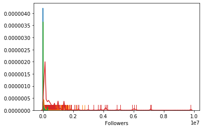
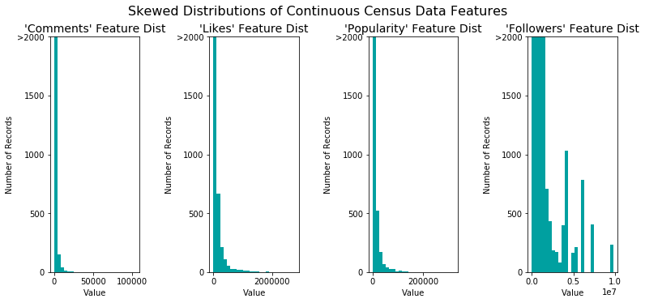
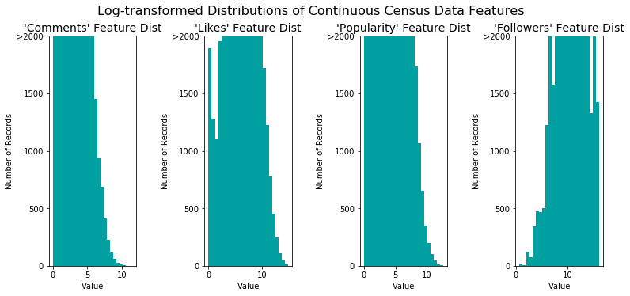
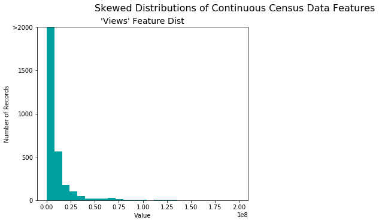
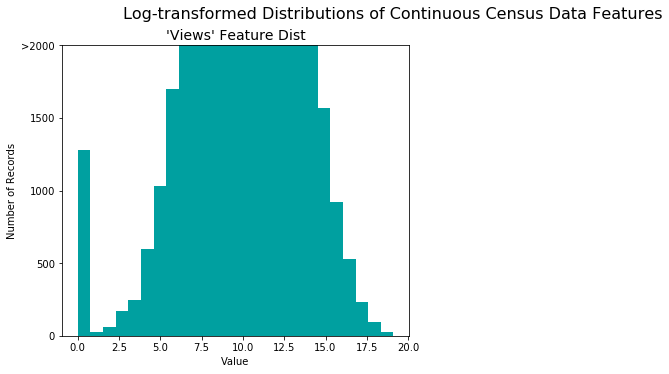

**Keywords:** Predicative modeling, Random Forest, XGBoost


[Github Code](https://github.com/Shakir1997/projects-portfolio-ML/tree/master/Predict%20the%20popularity%20of%20song)

# Loading Data 

```python
import pandas as pd
import numpy as np
import matplotlib.pyplot as plt
import seaborn as sns
from tqdm import tqdm_notebook, tnrange
import os
from sklearn.preprocessing import LabelEncoder

#os.chdir("/content/drive/My Drive/Chartbusters/ChartbustersParticipantsData")
%matplotlib inline
```


```python
train = pd.read_csv("Data_Train.csv")
test = pd.read_csv("Data_Test.csv")
print(train.shape)
print(test.shape)
```

    (78458, 11)
    (19615, 10)
    


```python
print(train.info())
print(test.info())
```

    <class 'pandas.core.frame.DataFrame'>
    RangeIndex: 78458 entries, 0 to 78457
    Data columns (total 11 columns):
    Unique_ID     78458 non-null int64
    Name          78458 non-null object
    Genre         78458 non-null object
    Country       78458 non-null object
    Song_Name     78457 non-null object
    Timestamp     78458 non-null object
    Views         78458 non-null int64
    Comments      78458 non-null int64
    Likes         78458 non-null object
    Popularity    78458 non-null object
    Followers     78458 non-null int64
    dtypes: int64(4), object(7)
    memory usage: 6.6+ MB
    None
    <class 'pandas.core.frame.DataFrame'>
    RangeIndex: 19615 entries, 0 to 19614
    Data columns (total 10 columns):
    Unique_ID     19615 non-null int64
    Name          19615 non-null object
    Genre         19615 non-null object
    Country       19615 non-null object
    Song_Name     19615 non-null object
    Timestamp     19615 non-null object
    Comments      19615 non-null int64
    Likes         19615 non-null object
    Popularity    19615 non-null object
    Followers     19615 non-null int64
    dtypes: int64(3), object(7)
    memory usage: 1.5+ MB
    None
    

# Data Cleaning


```python
train.Likes = (train.Likes.replace(r'[KM]+$', '', regex=True).astype(float) * \
   ....:           train.Likes.str.extract(r'[\d\.]+([KM]+)', expand=False)
   ....:             .fillna(1)
   ....:             .replace(['K','M'], [10**3, 10**6]).astype(int))

train.Popularity = (train.Popularity.replace(r'[KM]+$', '', regex=True).astype(float) * \
   ....:           train.Popularity.str.extract(r'[\d\.]+([KM]+)', expand=False)
   ....:             .fillna(1)
   ....:             .replace(['K','M'], [10**3, 10**6]).astype(int))

test.Likes = (test.Likes.replace(r'[KM]+$', '', regex=True).astype(float) * \
   ....:           test.Likes.str.extract(r'[\d\.]+([KM]+)', expand=False)
   ....:             .fillna(1)
   ....:             .replace(['K','M'], [10**3, 10**6]).astype(int))

test.Popularity = (test.Popularity.replace(r'[KM]+$', '', regex=True).astype(float) * \
   ....:           test.Popularity.str.extract(r'[\d\.]+([KM]+)', expand=False)
   ....:             .fillna(1)
   ....:             .replace(['K','M'], [10**3, 10**6]).astype(int))
```


```python
# training Data 
train['Likes'] = train['Likes'].astype(int)
train['Popularity'] = train['Popularity'].astype(int)
train['Name'] = train['Name'].astype(str)
train['Genre'] = train['Genre'].astype(str)
train['Country'] = train['Country'].astype(str)

# testing Data
test['Likes'] = test['Likes'].astype(int)
test['Popularity'] = test['Popularity'].astype(int)
test['Name'] = test['Name'].astype(str)
test['Genre'] = test['Genre'].astype(str)
test['Country'] = test['Country'].astype(str)
```


```python
train['Timestamp'] = pd.to_datetime(train['Timestamp'])
test['Timestamp'] = pd.to_datetime(test['Timestamp'])
```


```python
# Converting into Datetime format both training and testing data
#train['Timestamp'] = pd.to_datetime(train['Timestamp'])
#test['Timestamp'] = pd.to_datetime(test['Timestamp'])

# Add columns to training and testing data
train['year'] = pd.DatetimeIndex(train['Timestamp']).year
train['month'] = pd.DatetimeIndex(train['Timestamp']).month
train['day'] = pd.DatetimeIndex(train['Timestamp']).day
train['hour'] = pd.DatetimeIndex(train['Timestamp']).hour

test['year'] = pd.DatetimeIndex(test['Timestamp']).year
test['month'] = pd.DatetimeIndex(test['Timestamp']).month
test['day'] = pd.DatetimeIndex(test['Timestamp']).day
test['hour'] = pd.DatetimeIndex(test['Timestamp']).hour
```


```python
target = "Views"
target_value = train[target]
train.drop(["Views", "Unique_ID", "Song_Name", "Timestamp", "Name"], axis=1, inplace=True)
test.drop(["Unique_ID", "Song_Name", "Timestamp", "Name"], axis=1, inplace=True)
```


```python
print(train.head())
print(test.head())
```

          Genre Country  Comments  Likes  Popularity  Followers  year  month  day  \
    0  danceedm      AU         4    499          97     119563  2018      3   30   
    1  danceedm      AU        17     49          17       2141  2016      6   20   
    2  danceedm      AU        11    312          91      22248  2015      8    5   
    3    rbsoul      AU         2   2400          76     393655  2017      8    6   
    4  danceedm      AU        81   3031         699     201030  2016      9   17   
    
       hour  
    0    15  
    1     5  
    2    17  
    3    23  
    4    20  
           Genre Country  Comments  Likes  Popularity  Followers  year  month  \
    0  all-music      AU        26   5428         118       2568  2019      2   
    1   danceedm      AU        18    738         195     155645  2015      9   
    2   danceedm      AU        18    386          96      29446  2013      9   
    3  all-music      AU         1    388          19     799410  2007      8   
    4       rock      AU         0     79           1          2  2018     10   
    
       day  hour  
    0    1     9  
    1    3    17  
    2   18    16  
    3   14     0  
    4    8    16  
    


```python
target_value.head()
```


    0     14017
    1      1918
    2      9668
    3    113036
    4    110024
    Name: Views, dtype: int64


```python
target_value = pd.DataFrame(target_value, columns=['Views'])
```


```python
print("Total number of unique entries are {}".format(train['year'].nunique()))
print(train['year'].unique())
```

    Total number of unique entries are 31
    [2018 2016 2015 2017 2012 2014 2011 2013 2009 2019 2005 2004 2010 1994
     1991 2002 2007 2001 2003 2008 2006 1999 2000 1996 1973 1995 1992 1990
     1997 1979 1986]
    


```python
print(train['Country'].nunique())
print(train['Country'].unique())
train.drop(["Country"], axis=1, inplace=True)
test.drop(["Country"], axis=1, inplace=True)
```

    1
    ['AU']
    


```python
print(train['Genre'].nunique())
print(train['Genre'].unique())
```

    21
    ['danceedm' 'rbsoul' 'all-music' 'trap' 'latin' 'electronic' 'deephouse'
     'hiphoprap' 'classical' 'ambient' 'pop' 'rock' 'reggaeton' 'country'
     'disco' 'alternativerock' 'dubstep' 'drumbass' 'metal'
     'folksingersongwriter' 'indie']
    


```python
print(train.head())
print(test.head())
```

          Genre  Comments  Likes  Popularity  Followers  year  month  day  hour
    0  danceedm         4    499          97     119563  2018      3   30    15
    1  danceedm        17     49          17       2141  2016      6   20     5
    2  danceedm        11    312          91      22248  2015      8    5    17
    3    rbsoul         2   2400          76     393655  2017      8    6    23
    4  danceedm        81   3031         699     201030  2016      9   17    20
           Genre  Comments  Likes  Popularity  Followers  year  month  day  hour
    0  all-music        26   5428         118       2568  2019      2    1     9
    1   danceedm        18    738         195     155645  2015      9    3    17
    2   danceedm        18    386          96      29446  2013      9   18    16
    3  all-music         1    388          19     799410  2007      8   14     0
    4       rock         0     79           1          2  2018     10    8    16
    


```python
train.drop(['day', 'hour'], axis=1, inplace=True)
test.drop(['day', 'hour'], axis=1, inplace=True)
```


```python
print(train.head())
print(test.head())
print(target_value.head())
```

          Genre  Comments  Likes  Popularity  Followers  year  month
    0  danceedm         4    499          97     119563  2018      3
    1  danceedm        17     49          17       2141  2016      6
    2  danceedm        11    312          91      22248  2015      8
    3    rbsoul         2   2400          76     393655  2017      8
    4  danceedm        81   3031         699     201030  2016      9
           Genre  Comments  Likes  Popularity  Followers  year  month
    0  all-music        26   5428         118       2568  2019      2
    1   danceedm        18    738         195     155645  2015      9
    2   danceedm        18    386          96      29446  2013      9
    3  all-music         1    388          19     799410  2007      8
    4       rock         0     79           1          2  2018     10
        Views
    0   14017
    1    1918
    2    9668
    3  113036
    4  110024
    

# Data Preprocession

## Preprocessing only for non-tree based algorithm


```python
#fig, axs = plt.subplots(ncols=2, nrows=2)
sns.distplot(train['Comments'], hist=False, rug=True)
sns.distplot(train['Likes'], hist=False, rug=True)
sns.distplot(train['Popularity'], hist=False, rug=True)
sns.distplot(train['Followers'], hist=False, rug=True)
```


    <matplotlib.axes._subplots.AxesSubplot at 0x1c100721128>





```python
import matplotlib.pyplot as pl
def distribution(data, transformed = False):
    """
    Visualization code for displaying skewed distributions of features
    """
    
    # Create figure
    fig = pl.figure(figsize = (11,5));

    # Skewed feature plotting
    for i, feature in enumerate(['Comments','Likes', 'Popularity', 'Followers']):
        ax = fig.add_subplot(1, 4, i+1)
        ax.hist(train[feature], bins = 25, color = '#00A0A0')
        ax.set_title("'%s' Feature Dist"%(feature), fontsize = 14)
        ax.set_xlabel("Value")
        ax.set_ylabel("Number of Records")
        ax.set_ylim((0, 2000))
        ax.set_yticks([0, 500, 1000, 1500, 2000])
        ax.set_yticklabels([0, 500, 1000, 1500, ">2000"])

    # Plot aesthetics
    if transformed:
        fig.suptitle("Log-transformed Distributions of Continuous Census Data Features", \
            fontsize = 16, y = 1.03)
    else:
        fig.suptitle("Skewed Distributions of Continuous Census Data Features", \
            fontsize = 16, y = 1.03)

    fig.tight_layout()
    fig.show()
```


```python
distribution(train)
```

    C:\Users\shaki\Anaconda3\envs\tensorflow_env\lib\site-packages\ipykernel_launcher.py:30: UserWarning: Matplotlib is currently using module://ipykernel.pylab.backend_inline, which is a non-GUI backend, so cannot show the figure.
    





```python
skewed = ['Comments', 'Likes', 'Popularity', 'Followers']
train[skewed] = train[skewed].apply(lambda x: np.log(x + 1))
test[skewed] = test[skewed].apply(lambda x: np.log(x+ 1 ))
# Visualize the new log distributions
distribution(train, transformed = True)
```

    C:\Users\shaki\Anaconda3\envs\tensorflow_env\lib\site-packages\ipykernel_launcher.py:30: UserWarning: Matplotlib is currently using module://ipykernel.pylab.backend_inline, which is a non-GUI backend, so cannot show the figure.
    





```python
import matplotlib.pyplot as pl
def distribution(data, transformed = False):
    """
    Visualization code for displaying skewed distributions of features
    """
    
    # Create figure
    fig = pl.figure(figsize = (11,5));

    # Skewed feature plotting
    for i, feature in enumerate(['Views']):
        ax = fig.add_subplot(1, 2, i+1)
        ax.hist(target_value[feature], bins = 25, color = '#00A0A0')
        ax.set_title("'%s' Feature Dist"%(feature), fontsize = 14)
        ax.set_xlabel("Value")
        ax.set_ylabel("Number of Records")
        ax.set_ylim((0, 2000))
        ax.set_yticks([0, 500, 1000, 1500, 2000])
        ax.set_yticklabels([0, 500, 1000, 1500, ">2000"])

    # Plot aesthetics
    if transformed:
        fig.suptitle("Log-transformed Distributions of Continuous Census Data Features", \
            fontsize = 16, y = 1.03)
    else:
        fig.suptitle("Skewed Distributions of Continuous Census Data Features", \
            fontsize = 16, y = 1.03)

    fig.tight_layout()
    fig.show()
```


```python
distribution(target_value)
```

    C:\Users\shaki\Anaconda3\envs\tensorflow_env\lib\site-packages\ipykernel_launcher.py:30: UserWarning: Matplotlib is currently using module://ipykernel.pylab.backend_inline, which is a non-GUI backend, so cannot show the figure.
    





```python
skewed = ['Views']
target_value[skewed] = target_value[skewed].apply(lambda x: np.log(x + 1))

distribution(target_value, transformed=True)
```

    C:\Users\shaki\Anaconda3\envs\tensorflow_env\lib\site-packages\ipykernel_launcher.py:30: UserWarning: Matplotlib is currently using module://ipykernel.pylab.backend_inline, which is a non-GUI backend, so cannot show the figure.
    





```python
print(train.head())
print(test.head())
print(target_value.head())
```

          Genre  Comments     Likes  Popularity  Followers  year  month
    0  danceedm  1.609438  6.214608    4.584967  11.691607  2018      3
    1  danceedm  2.890372  3.912023    2.890372   7.669495  2016      6
    2  danceedm  2.484907  5.746203    4.521789  10.010052  2015      8
    3    rbsoul  1.098612  7.783641    4.343805  12.883233  2017      8
    4  danceedm  4.406719  8.016978    6.551080  12.211214  2016      9
           Genre  Comments     Likes  Popularity  Followers  year  month
    0  all-music  3.295837  8.599510    4.779123   7.851272  2019      2
    1   danceedm  2.944439  6.605298    5.278115  11.955339  2015      9
    2   danceedm  2.944439  5.958425    4.574711  10.290347  2013      9
    3  all-music  0.693147  5.963579    2.995732  13.591630  2007      8
    4       rock  0.000000  4.382027    0.693147   1.098612  2018     10
           Views
    0   9.548097
    1   7.559559
    2   9.176680
    3  11.635470
    4  11.608463
    

## Preprocessing for tree based algorithm


```python
label_encoding = LabelEncoder()
#catg = ['Genre', 'year', 'month']
train['Genre'] = label_encoding.fit_transform(train['Genre'])
#train['year'] = label_encoding.fit_transform(train['year'])
#train['month'] = label_encoding.fit_transform(train['month'])

test['Genre'] = label_encoding.fit_transform(test['Genre'])
#test['year'] = label_encoding.fit_transform(test['year'])
#test['month'] = label_encoding.fit_transform(test['month'])
#train['Genre'] = label_encoding.transform(train['Genre'])
```


```python
print(train.head(n=3))
print(test.head(n=3))
```

       Genre  Comments     Likes  Popularity  Followers  year  month
    0      5  1.609438  6.214608    4.584967  11.691607  2018      3
    1      5  2.890372  3.912023    2.890372   7.669495  2016      6
    2      5  2.484907  5.746203    4.521789  10.010052  2015      8
       Genre  Comments     Likes  Popularity  Followers  year  month
    0      0  3.295837  8.599510    4.779123   7.851272  2019      2
    1      5  2.944439  6.605298    5.278115  11.955339  2015      9
    2      5  2.944439  5.958425    4.574711  10.290347  2013      9
    


```python
from sklearn.model_selection import train_test_split

# Split the 'features' and 'income' data into training and testing sets
X_train, X_test, y_train, y_test = train_test_split(train, 
                                                    target_value, 
                                                    test_size = 0.2, 
                                                    random_state = 123)

# Show the results of the split
print("Training set has {} samples.".format(X_train.shape[0]))
print("Testing set has {} samples.".format(X_test.shape[0]))
```

    Training set has 62766 samples.
    Testing set has 15692 samples.
    

# Applying Different algorithm

## sub_3_bs model


```python
import xgboost as xgb
xg_reg = xgb.XGBRegressor(colsample_bytree=1, max_depth=5, min_child_weight=1, n_estimators=400)
xg_reg.fit(X_train,y_train)
preds = xg_reg.predict(X_test)
preds.shape
```

    [22:59:03] WARNING: C:/Jenkins/workspace/xgboost-win64_release_0.90/src/objective/regression_obj.cu:152: reg:linear is now deprecated in favor of reg:squarederror.
    


    (15692,)


```python
import sklearn
rmse = np.sqrt(sklearn.metrics.mean_squared_error(y_test, preds))
print("RMSE: %f" % (rmse))

y_out = xg_reg.predict(test)
y_out = np.reshape(y_out, (-1,1))
```

    RMSE: 653199.524651
    

## sub_12 best model


```python
import xgboost as xgb
xg_reg = xgb.XGBRegressor(colsample_bytree=1, max_depth=5, min_child_weight=1, n_estimators=500)
xg_reg.fit(X_train,y_train)
preds = xg_reg.predict(X_test)
preds.shape
```

    [09:31:21] WARNING: C:/Jenkins/workspace/xgboost-win64_release_0.90/src/objective/regression_obj.cu:152: reg:linear is now deprecated in favor of reg:squarederror.
    


    (15692,)


```python
import sklearn
rmse = np.sqrt(sklearn.metrics.mean_squared_error(y_test, preds))
print("RMSE: %f" % (rmse))

y_out = xg_reg.predict(test)
y_out = np.reshape(y_out, (-1,1))
```

    RMSE: 652720.452490
    


```python
y_out = pd.DataFrame(data=y_out, columns=['Views'])
```


```python
t1 = pd.read_csv('Data_Test.csv')
fin = pd.concat([t1['Unique_ID'], y_out['Views']], axis=1, names=['Unique_ID', 'Views'])
fin.to_csv("result.csv")
res = pd.read_csv("result.csv", index_col=['Unique_ID'])
res.drop(['Unnamed: 0'], axis=1, inplace=True)
res.to_csv("result.csv")
```


```python

```

## sub_11 2 best model


```python
import xgboost as xgb
xg_reg = xgb.XGBRegressor(colsample_bytree=1, max_depth=5)
xg_reg.fit(X_train,y_train)
preds = xg_reg.predict(X_test)
preds.shape
```

    [09:39:23] WARNING: C:/Jenkins/workspace/xgboost-win64_release_0.90/src/objective/regression_obj.cu:152: reg:linear is now deprecated in favor of reg:squarederror.
    


    (15692,)


```python
import sklearn
rmse = np.sqrt(sklearn.metrics.mean_squared_error(y_test, preds))
print("RMSE: %f" % (rmse))

y_out = xg_reg.predict(test)
y_out = np.reshape(y_out, (-1,1))
```

    RMSE: 687064.042208
    

## RandomForest Algorithm


```python
from sklearn.ensemble import RandomForestRegressor
```


```python
model = RandomForestRegressor(n_estimators=200, random_state=0)
model.fit(X_train, y_train)
```

    C:\Users\shaki\Anaconda3\envs\tensorflow_env\lib\site-packages\ipykernel_launcher.py:2: DataConversionWarning: A column-vector y was passed when a 1d array was expected. Please change the shape of y to (n_samples,), for example using ravel().
      
    


    RandomForestRegressor(bootstrap=True, criterion='mse', max_depth=None,
                          max_features='auto', max_leaf_nodes=None,
                          min_impurity_decrease=0.0, min_impurity_split=None,
                          min_samples_leaf=1, min_samples_split=2,
                          min_weight_fraction_leaf=0.0, n_estimators=200,
                          n_jobs=None, oob_score=False, random_state=0, verbose=0,
                          warm_start=False)


```python
preds = model.predict(X_test)
```


```python
predictions = model.predict(test)
```


```python
import sklearn
rmse = np.sqrt(sklearn.metrics.mean_squared_error(y_test, preds))
print("RMSE: %f" % (rmse))
```

    RMSE: 768164.961457
    


```python
y_out = pd.DataFrame(data=predictions, columns=['Views'])
```

## GradientBoostingAlgorithm


```python
from sklearn.ensemble import GradientBoostingRegressor
grb=GradientBoostingRegressor(learning_rate=0.1,n_estimators=200, max_depth=5
                              ,subsample=0.8,
                              verbose=True,random_state=10)
```


```python
grb.fit(X_train, y_train)
```

    C:\Users\shaki\Anaconda3\envs\tensorflow_env\lib\site-packages\sklearn\ensemble\gradient_boosting.py:1450: DataConversionWarning: A column-vector y was passed when a 1d array was expected. Please change the shape of y to (n_samples, ), for example using ravel().
      y = column_or_1d(y, warn=True)
    

          Iter       Train Loss      OOB Improve   Remaining Time 
             1 11476674610981.4082 3840863089772.7930           20.09s
             2 9866672255542.0566 2406720072630.9277           19.69s
             3 8330430346923.1592 1738174885540.3906           19.16s
             4 6993864977081.2383 1214466522607.9082           18.32s
             5 5469402885722.8359 1416490844786.0049           17.89s
             6 4705869042506.9512 793548231609.7095           17.81s
             7 3931982905909.7578 557592720648.4448           17.47s
             8 3185043505855.1875 514952954257.7817           17.22s
             9 2494029947183.8403 562861864815.6255           17.37s
            10 2081111433765.3962 413652236944.8169           17.13s
            20 446882786325.4976 36216233868.0272           16.02s
            30 188417538675.2888  5458222840.5702           15.05s
            40 137242149572.8594    37777520.4012           14.10s
            50 113432768082.3768  -313756691.5271           12.90s
            60 101288279593.5180  -234674436.8158           11.86s
            70 89934317959.5893    69824332.4267           11.27s
            80 79050263288.7053   102179840.4725           10.36s
            90 68929127333.5310  -186081434.6905            9.44s
           100 61611051065.0692  -347528503.8614            8.55s
           200 29355345339.6046   -11435975.8146            0.00s
    


    GradientBoostingRegressor(alpha=0.9, criterion='friedman_mse', init=None,
                              learning_rate=0.1, loss='ls', max_depth=5,
                              max_features=None, max_leaf_nodes=None,
                              min_impurity_decrease=0.0, min_impurity_split=None,
                              min_samples_leaf=1, min_samples_split=2,
                              min_weight_fraction_leaf=0.0, n_estimators=200,
                              n_iter_no_change=None, presort='auto',
                              random_state=10, subsample=0.8, tol=0.0001,
                              validation_fraction=0.1, verbose=True,
                              warm_start=False)


```python
preds = grb.predict(X_test)
preds.shape
```


    (15692,)


```python
import sklearn
rmse = np.sqrt(sklearn.metrics.mean_squared_error(y_test, preds))
print("RMSE: %f" % (rmse))

y_out = xg_reg.predict(test)
y_out = np.reshape(y_out, (-1,1))
```

    RMSE: 694455.207721
    

# Submission


```python
y_out = pd.DataFrame(data=y_out, columns=['Views'])
```


```python
t1 = pd.read_csv('Data_Test.csv')
fin = pd.concat([t1['Unique_ID'], y_out['Views']], axis=1, names=['Unique_ID', 'Views'])
fin.to_csv("result.csv")
res = pd.read_csv("result.csv", index_col=['Unique_ID'])
res.drop(['Unnamed: 0'], axis=1, inplace=True)
res.to_csv("result.csv")
```


```python

```
